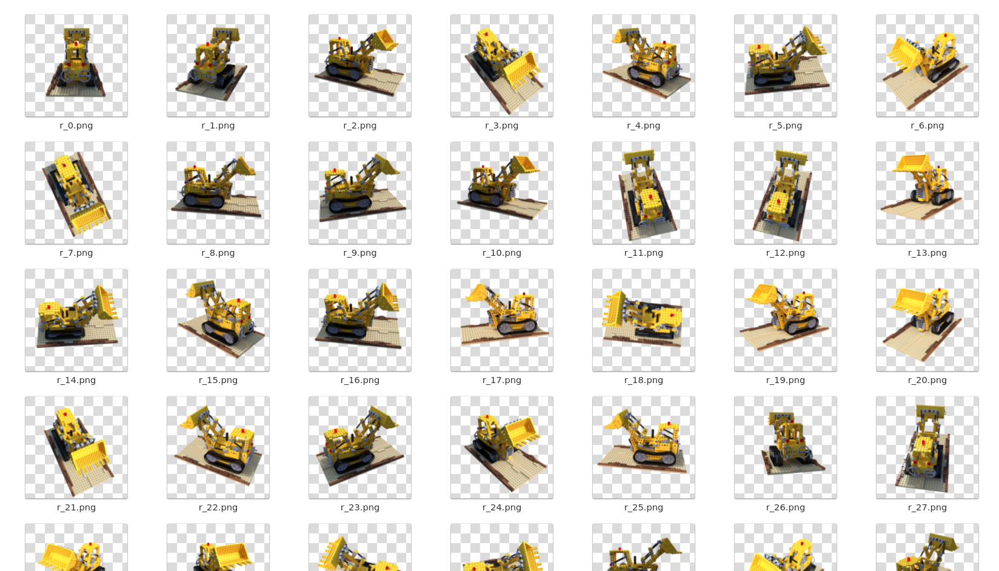

# Scan-3D-InstantNGP

Dự án tái tạo vật thể 3D từ Video và Hình ảnh sử dụng công nghệ NeRF (Instant-NGP).
Hệ thống cho phép người dùng huấn luyện mô hình 3D từ dữ liệu 2D (video/ảnh), quản lý các mô hình đã huấn luyện bằng giao diện đồ họa (GUI), và cung cấp API/Server để kết nối với các ứng dụng di động (nhận video tải lên, xem 3D thời gian thực).

## 📸 Demo & Kết quả



### Video hiển thị
<video src="https://raw.githubusercontent.com/HoangGiap1804/Scan-3D-InstantNGP/feat/optimized_render/assets/2026-06-15%2021-10-26.mp4" controls="controls" width="100%"></video>
<br>
<video src="https://raw.githubusercontent.com/HoangGiap1804/Scan-3D-InstantNGP/feat/optimized_render/assets/2026-06-15%2021-15-58.mp4" controls="controls" width="100%"></video>

## 1. Cài đặt môi trường

Đảm bảo bạn đã cài đặt Python 3.9+ và các thư viện cần thiết. Khuyến nghị sử dụng môi trường ảo (virtual environment) hoặc Nix.
```bash
pip install -r requirements.txt
```
*(Nếu sử dụng Nix, bạn có thể chạy `nix-shell shell.nix` để cấu hình nhanh)*

## 2. Các thành phần chính của dự án

### Giao diện Quản lý Mô hình (Model Manager GUI)
Giao diện giúp bạn dễ dàng quản lý các dataset, cấu hình và khởi chạy quá trình huấn luyện, cũng như chia sẻ mô hình 3D.
```bash
python model_manager_ui.py
```
Tại đây, bạn có thể:
- Thêm dataset mới (chọn file `transform.json` hoặc thư mục cấu hình).
- Bắt đầu/dừng quá trình huấn luyện mô hình với các tùy chọn (`iters`, `learning rate`, `bound`, `scale`,...).
- Chia sẻ mô hình (khởi chạy Server xem 3D qua mạng LAN).

### Khởi chạy Server kết nối Mobile App
Bạn có thể dùng GUI để nhấn "Share", hoặc chạy thủ công máy chủ để phục vụ kết nối với thiết bị di động:
```bash
python nerf_server.py <đường_dẫn_dataset> --workspace ./workspaces/my_model --bound 1.0 --scale 0.7 -O
```
Máy chủ này sẽ cung cấp luồng video tương tác 3D qua WebSockets.

### Huấn luyện Mô hình (Training) qua Command Line
Ngoài việc dùng GUI, bạn có thể chạy trực tiếp bằng lệnh để can thiệp sâu hơn vào tiến trình huấn luyện:
```bash
# Huấn luyện cơ bản có hiển thị GUI của NeRF:
python main_nerf.py data/custom_data/ --workspace workspaces/custom -O --bound 1.0 --scale 0.7 --gui

# Huấn luyện chất lượng cao, tăng tốc không hiển thị GUI:
python main_nerf.py data/custom_data/ --workspace workspaces/custom -O --bound 1.0 --scale 0.7 --dt_gamma 0 --iters 30000
```
*Ghi chú:*
- `-O`: Bật chế độ tối ưu (FP16, CUDA raymarching).
- `--gui`: Bật giao diện tương tác 3D trong quá trình train/test để theo dõi kết quả ngay lập tức.

## 3. Tiền xử lý Dữ liệu (COLMAP)
Để mô hình NeRF có thể huấn luyện, Video/Hình ảnh cần được chuyển đổi để trích xuất vị trí các camera (sử dụng COLMAP). Các tập lệnh nằm trong thư mục `scripts`:

**Từ Video (Khuyên dùng):**
```bash
python scripts/colmap2nerf.py --video ./videos/test.mp4 --run_colmap --video_fps 2 --size 800x800
```
- `--video_fps 2`: Trích xuất 2 khung hình mỗi giây.
- `--size 800x800`: Giảm kích thước ảnh giúp quá trình xử lý và huấn luyện nhanh hơn.

**Từ thư mục chứa ảnh:**
```bash
python scripts/colmap2nerf.py --images ./data/my_folder --run_colmap
```

## 4. API & WebSocket dành cho Mobile App
Hệ thống cung cấp giao tiếp API để trao đổi với Mobile App (được tích hợp trong luồng server):
- **Tải lên Video (Upload API)**
  - Tải file video trực tiếp từ app lên máy chủ lưu vào thư mục `videos/` để hệ thống tiền xử lý tự động.
- **Trình chiếu tương tác 3D (WebSocket Viewer)**
  - Giao tiếp với thiết bị qua định dạng chuỗi JSON để truyền tín hiệu điều hướng xoay/zoom vật thể. Máy chủ sẽ render khung hình 3D tương ứng và gửi về thiết bị để hiển thị mượt mà.

## Các lưu ý quan trọng:
- **Yêu cầu GPU**: Để tốc độ xử lý nhanh nhất, yêu cầu thiết bị chạy có Card đồ họa NVIDIA hỗ trợ CUDA. Quá trình tính toán NeRF rất nặng về GPU.
- COLMAP sẽ tự động phát hiện và sử dụng CUDA.
- **Quản lý Dữ liệu**: Khi xóa một dataset trên giao diện (Model Manager UI), dữ liệu workspace (checkpoint mô hình) cũng có thể sẽ được xóa để giải phóng bộ nhớ. Hãy lưu ý backup khi cần.
