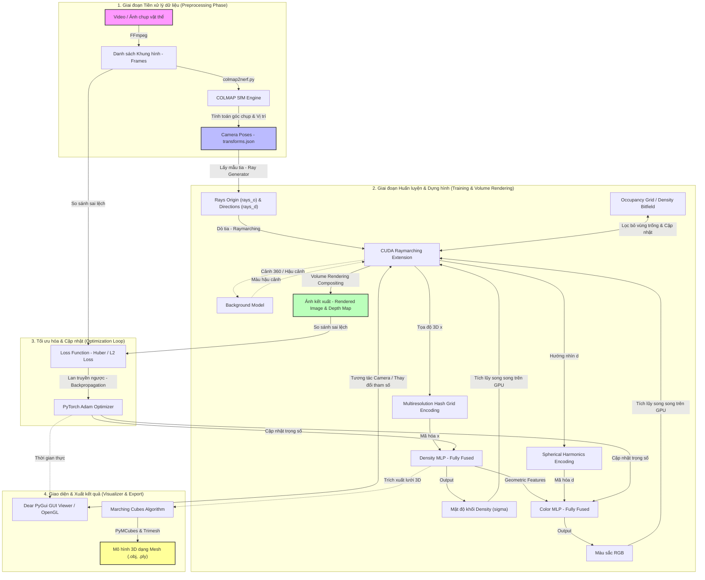

# KIẾN TRÚC HỆ THỐNG PHỤC DỰNG 3D INSTANT-NGP

Tài liệu này mô tả chi tiết **Kiến trúc hệ thống** của dự án **Scan-3D-InstantNGP**, bao gồm luồng dữ liệu tổng thế, các phân hệ chức năng chính, và cách thức hoạt động đồng bộ của mô hình từ dữ liệu thô đầu vào cho đến khi xuất ra mô hình 3D hoàn chỉnh.

---

## 1. Sơ đồ kiến trúc tổng thể (System Architecture Diagram)

Dưới đây là sơ đồ luồng dữ liệu và cấu trúc phân lớp chức năng của hệ thống. Sơ đồ được vẽ bằng cú pháp **Mermaid**:

---

## 2. Các phân hệ chức năng chính

Kiến trúc hệ thống bao gồm **4 phân hệ cốt lõi** hoạt động tuần tự và khép kín:

### 2.1. Phân hệ 1: Tiền xử lý dữ liệu và ước lượng Pose (Data Preprocessing)
*   **Đầu vào:** Video ngắn hoặc tập hợp hình ảnh chụp thực tế của vật thể 3D từ nhiều góc độ khác nhau.
*   **FFmpeg:** Chịu trách nhiệm trích xuất các khung hình chất lượng cao từ video gốc tại tần suất khung hình mong muốn (ví dụ: 2 FPS).
*   **COLMAP Engine:** Chạy thuật toán **Structure-from-Motion (SfM)** để đối sánh các điểm đặc trưng giữa các ảnh, từ đó ước lượng chính xác ma trận vị trí và hướng quay của camera đối với vật thể, xuất ra file cấu hình định dạng NeRF (`transforms.json` hoặc `transforms_train.json`).

> [!NOTE]
> File `transforms.json` chứa các thông số tiêu cự camera ($f_x, f_y$), tâm ảnh ($c_x, c_y$) và ma trận biến đổi tọa độ $4 \times 4$ (extrinsic matrix) của từng khung hình để phục vụ tạo tia (Ray Generation).

### 2.2. Phân hệ 2: Huấn luyện và Dựng hình thể tích (Training & Volume Rendering)
Đây là trái tim của hệ thống Instant-NGP, được tối ưu hóa cực hạn trên GPU để đạt tốc độ xử lý thời gian thực:
*   **Ray Generator:** Dựa trên ma trận camera `transforms.json`, hệ thống phóng các tia ảo ($Rays$) từ tâm camera đi qua từng pixel ảnh vào không gian 3D.
*   **Nhân CUDA Raymarching tùy chỉnh (`raymarching`):** Tiến hành dò tia dọc theo hướng đi. Để tăng tốc, nó liên tục truy vấn **Occupancy Grid** (lưới mật độ nhị phân đa tầng) nhằm bỏ qua các vùng không gian trống không chứa vật thể, chỉ lấy mẫu các điểm thực sự nằm gần bề mặt vật thể.
*   **Truy vấn mạng thần kinh tích hợp (`tinycudann`):**
    *   *Tọa độ 3D ($x, y, z$)* được chuẩn hóa về $[0, 1]$, đi qua bộ mã hóa **Hash Grid đa phân giải** để chuyển đổi thành các vector đặc trưng tần số cao, sau đó đi qua mạng **Density MLP** (Fully Fused MLP) để lấy ra mật độ khối ($\sigma$) và đặc trưng hình học đại số (`geo_feat`).
    *   *Hướng nhìn camera ($d$)* được mã hóa bằng **Spherical Harmonics**, kết hợp đặc trưng hình học `geo_feat` đi qua mạng **Color MLP** (Fully Fused MLP), trả về giá trị màu sắc ($R, G, B$) tại điểm đó.
    *   *Hậu cảnh (Background Model):* Phục dựng riêng phần hậu cảnh (Background sphere) cho các cảnh quay 360 độ hoặc cảnh chụp ngoài trời rộng.
*   **Volume Rendering Compositing:** Tích lũy song song toàn bộ mật độ và màu sắc của các điểm lấy mẫu dọc theo tia trên GPU để tổng hợp thành màu sắc ($C$) và độ sâu ($D$) của điểm ảnh hiển thị trên màn hình.

### 2.3. Phân hệ 3: Vòng lặp tối ưu hóa (Optimization Loop)
*   Hệ thống so sánh ảnh được kết xuất từ mô hình (`Rendered Image`) với ảnh chụp thực tế đầu vào (`Ground Truth Frames`) thông qua hàm mất mát **Huber Loss** hoặc **L2 Loss** (và tùy chọn chỉ số chất lượng cảm nhận **LPIPS**).
*   Sai số được truyền ngược (Backpropagation) về để cập nhật trọng số của các mạng MLP và bảng Hash Grid qua bộ tối ưu hóa **Adam Optimizer**, đồng thời cập nhật lại giá trị lưới mật độ **Occupancy Grid** thông qua cơ chế EMA (Exponential Moving Average).

### 2.4. Phân hệ 4: Tương tác người dùng và Kết xuất vật thể (Visualizer & Export)
*   **Dear PyGui Real-Time Viewer:** Sử dụng nhân đồ họa OpenGL để hiển thị trực quan quá trình huấn luyện đang diễn ra. Giao diện cung cấp cho người dùng khả năng xoay, thu phóng camera ảo để xem mô hình 3D thực tế thời gian thực và cấu hình các siêu tham số học.
*   **Marching Cubes (Trích xuất Mesh):** Sau khi mô hình hội tụ, hệ thống quét trường mật độ (Density Field) bằng thuật toán **Marching Cubes** (`PyMCubes`), sau đó dùng `Trimesh` để làm mịn bề mặt và xuất ra file lưới đa giác dạng `.obj` hoặc `.ply` để sử dụng trong các phần mềm đồ họa chuyên nghiệp (Blender, Unity, Unreal Engine).

---

## 3. Bản đồ tóm tắt công nghệ theo tầng (Technology Stack Layers)

| Tầng công nghệ | Công nghệ sử dụng | Vai trò trong hệ thống |
| :--- | :--- | :--- |
| **Giao diện & API** | Dear PyGui, PyOpenGL, FastAPI, Uvicorn | Trực quan hóa mô hình 3D thời gian thực và quản lý tác vụ nền (background tasks). |
| **Học sâu & Mạng lõi**| PyTorch 2.1.2, tinycudann, torch-ema | Huấn luyện mạng thần kinh, tối ưu hóa FP16, mã hóa băm đa phân giải Hash Grid và MLP song song. |
| **Tăng tốc dò tia** | CUDA C++ Extensions (Custom `raymarching`) | Thực hiện tích phân thể tích (volume rendering) song song trực tiếp trên GPU. |
| **Phục dựng Camera** | COLMAP, FFmpeg, OpenCV | Tách khung hình từ video và ước lượng vị trí, tiêu cự camera (extrinsic/intrinsic). |
| **Môi trường hệ thống**| Linux OS, Nix Shell, Python venv 3.10 | Cô lập môi trường biên dịch CUDA Toolkit, GCC, cuDNN và tránh xung đột thư viện. |
| **Phần cứng vật lý** | NVIDIA GPU (RTX 2050 trở lên), RAM 16GB | Cung cấp nhân đồ họa chuyên dụng và nhân Tensor Cores tăng tốc tính toán. |
