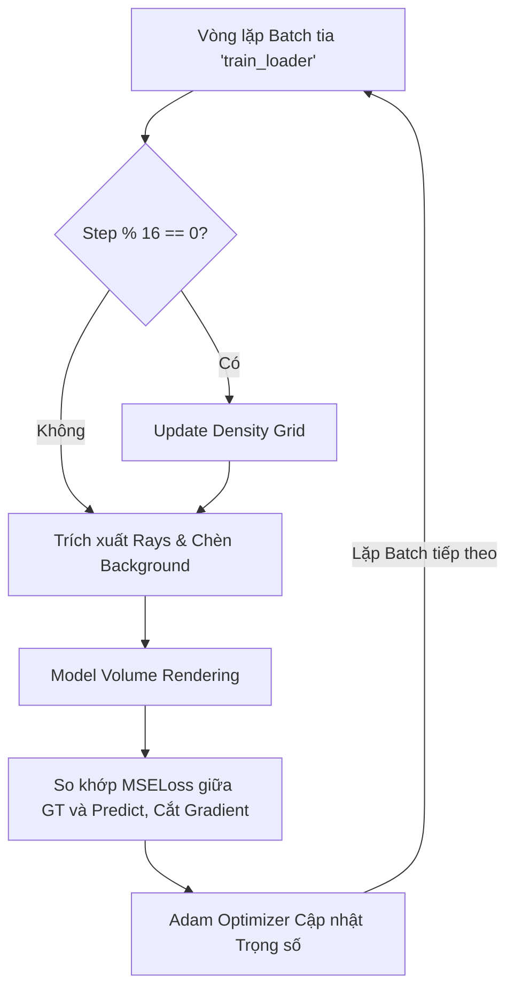

# Giải thích chi tiết Vòng lặp Batch Training trong File `train.py`

Giai đoạn này là quy trình cốt lõi của Instant-NGP, mô tả cách mà mô hình lặp qua các tia (rays), dự đoán màu sắc, so sánh với ảnh thực tế (Ground Truth) và tinh chỉnh trọng số (Weights).

Dưới đây là chi tiết từng bước, kết nối logic giữa file `train.py` và các file hệ thống khác (`provider.py`, `renderer.py`, `model.py`).

## Sơ đồ khối (Dòng chảy Logic)



---

## Phân tích chi tiết từng bước

### 1. (H) Vòng lặp Batch tia (`train_loader`)
* **Mô tả:** Mô hình không nạp toàn bộ ảnh vào do thiết hụt VRAM, thay vào đó nó sẽ lấy một "batch" các tia ngẫu nhiên.
* **Code liên quan:**
  * **Trong `train.py` (Dòng ~105):** `for data in train_loader:`
  * **Trong `provider.py` (Hàm `collate`, Dòng ~107):** Dataloader mỗi lần gọi sẽ hướng đến hàm này. Nó sử dụng hàm `get_rays()` để phóng ra một số lượng tia (`num_rays = 4096`) tương ứng với camera pose hiện tại. Dữ liệu trả về (gán vào biến `data`) bao gồm hướng tia (`rays_d`), gốc tia (`rays_o`) và màu pixel gốc (`images`).

---

### 2. (I & J) Kiểm tra bước và Cập nhật lưới mặt độ (`Update Density Grid`)
* **Mô tả:** Trong Instant-NGP, tốc độ siêu nhanh đến từ việc mô hình bỏ qua (skip) không gian rỗng thay vì tính toán dọc theo toàn bộ tia. Để làm được, thuật toán duy trì một mạng lưới (Grid) 3D thô tóm tắt xem chỗ nào có vật thể (Occupied) và chỗ nào trống rỗng. Lưới này được cập nhật định kỳ mỗi 16 batch.
* **Code liên quan:**
  * **Trong `train.py` (Dòng ~109-112):**
    ```python
    if model.cuda_ray and global_step % 16 == 0:
        model.update_extra_state()
    ```
  * **Trong `renderer.py` (Dòng ~408 - Hàm `update_extra_state`):** Mô hình tính toán và cập nhật lại biến `density_grid` và `density_bitfield`. Việc này ép hệ thống loại bỏ những vùng voxel đang lơ lửng không có mật độ vật thể đứt gãy.

---

### 3. (K) Trích xuất Rays & Xử lý Alpha (Background Mới)
* **Mô tả:** Trích xuất các tensor liên quan đến tia. Tối ưu hoá kênh alpha (trong suốt).
* **Code liên quan (`train.py`, Dòng ~115-124):**
    ```python
    rays_o = data['rays_o'] # Gốc tia
    rays_d = data['rays_d'] # Hướng tia
    gt_rgb = data['images'] # Màu Ground Truth

    if gt_rgb.shape[-1] == 4: # Nếu ảnh có kênh Alpha (trong suốt)
        bg_color = torch.rand_like(gt_rgb[..., :3]) # Tạo nhiễu màu tự do
        gt_rgb = gt_rgb[..., :3] * gt_rgb[..., 3:] + bg_color * (1 - gt_rgb[..., 3:])
    ```
    * **Tại sao phải làm vậy?** Bằng cách chọn một màu ngầm định (background color) bằng tính ngẫu nhiên (random noise) rồi blend với kênh trong suốt, mô hình NeRF sẽ bị "ép" phải học cách dự đoán màu vật thể chuẩn xác hơn ranh giới biên thay vì ăn gian vào phông nền mờ.

---

### 4. (L) Volume Rendering - Quá Trình Render Dự Đoán
* **Mô tả:** Tại bước này, gốc tia và hướng tia được đẩy vào mạng Neuron để dò xét từng điểm dọc theo tia, tính toán mật độ `sigma` và màu `color` rồi tích phân chúng lại thành 1 điểm ảnh duy nhất.
* **Code liên quan:** 
  * **Trong `train.py` (Dòng ~126):**
    ```python
    outputs = model.render(rays_o, rays_d, staged=False, bg_color=bg_color, perturb=True, max_steps=args.max_steps)
    pred_rgb = outputs['image']
    ```
  * **Trong `renderer.py` (Hàm `run_cuda` - Dòng ~251):** Chứa hệ thống xử lý Ray Marching gọi lõi C++ CUDA `raymarching.march_rays_train` sinh ra toạ độ điểm mù `xyzs`. Sau đó toạ độ này được đá sang `model.py` (Mạng `NeRFNetwork` hàm `forward()`) để mạng neural nội dung đánh giá lưới toạ độ đó có màu và khói lấp nào. Trong tích tắc, API trả về pixel ảo `outputs['image']`. Cờ `perturb=True` đảm bảo lấy mẫu tia ngẫu nhiên (chống vỡ nhiễu răng cưa).

---

### 5. (M) Tính MSELoss & Cắt Gradient (Gradient Clipping)
* **Mô tả:** Kiểm tra độ lệch bằng Mean Squared Error (MSE), sau đó tính đạo hàm ngược (Backpropagation) và dằn (clip) giá trị này để khỏi bị lỗi. 
* **Code liên quan (`train.py`, Dòng ~129-134):**
    ```python
    loss = criterion(pred_rgb, gt_rgb).mean()
    loss.backward()
    torch.nn.utils.clip_grad_norm_(model.parameters(), 1.0) # Cắt gradient
    ```
    * **Chi Tiết:** Việc tích phân thể tích nhiều khi sinh ra những hố dốc Gradient quá lớn đẩy trọng số vượt giới hạn (thành lỗi NaN). Do đó `clip_grad_norm_` sẽ giới hạn véc tơ đạo hàm ở định mức trần là `1.0`.

---

### 6. (N) Tối ưu hóa (Optimizer Step)
* **Mô tả:** Nếu trải qua các bước trên không có vấn đề gì (gradient không bị vỡ NaN), nó sẽ cập nhật trọng số và phân rã nhịp độ học (learning rate thu hẹp dần).
* **Code liên quan (`train.py`, Dòng ~136-140):**
    ```python
    if torch.isnan(loss):
        print(f"Warning: NaN detected in loss..., skipping update.")
        optimizer.zero_grad()
    else:
        optimizer.step()     # Cập nhật trọng số mạng Neuron
        scheduler.step()     # Ép Learning rate giảm dần
    ```
